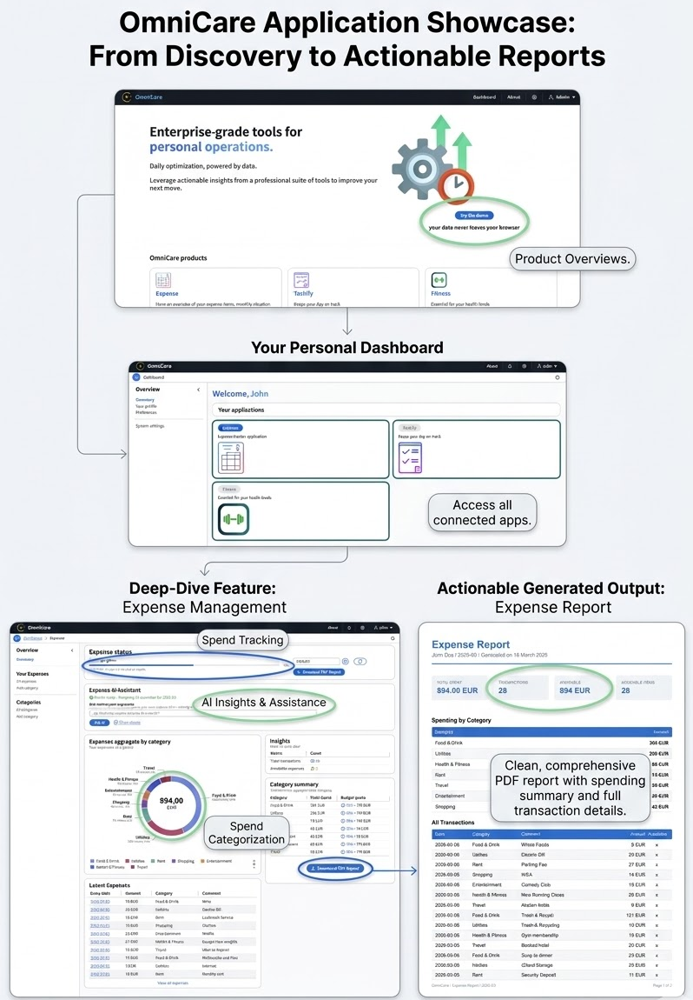

# OmniCare

A privacy-first personal finance and productivity platform that runs entirely
in your browser - no account required, no data ever leaves your device.



**[Live Demo](https://teduard.github.io/OmniCare)**

> **Note:** The live demo is pre-loaded with seed data so every feature is
> immediately explorable without signing up or entering real information.

---

## What It Does

**Expense tracking** - Add, edit, and categorise expenses. Explore spending
by month via an interactive pie chart, pivot table, and full transaction list.
Export any month as a formatted PDF report with a single click.

**AI Expense Assistant** - Ask natural-language questions about your spending
("What did I spend most on this month?", "How much was avoidable?") and
receive analysis powered by a language model running entirely inside your
browser via WebLLM. 100% privacy, data never leaves the device.

> **Note:** Since the number of parameters for the selected `SmolLM2-135M-Instruct` LLM is quite low,
> the provided insights might not be accurate enough.
> Real use case scenarios should use models that allow for better understanding

**Task management (Taskifier)** - _Planned_

**Fitness and Organisation modules** - _Planned_

**Offline-capable PWA** - Installable on any device, works without a network
connection after the first load.

---

## Local-First approach

Most personal finance apps require an account and store data on a server.
OmniCare takes the opposite direction: the data lives in your
browser, and the app is fully functional with no network access after install.

This is made possible by running a real SQLite database in the browser via
[sql.js](https://sql-wasm.js.org/) (WebAssembly), with the database serialised
to `localStorage` for persistence across sessions. The same approach powers
the in-browser AI inference - the language model weights are downloaded once
and cached locally by the browser.

---

## AI Features

### Expense Assistant (WebLLM)

The AI assistant uses [WebLLM](https://webllm.mlc.ai/) to run
`SmolLM2-135M-Instruct` inference directly in the browser via WebGPU. When
you ask a question, the app builds a plain-text summary of your current
month's expense data - totals, category breakdown, avoidable spend - and
passes it as context to the model. The model never sees raw transactions, only
the aggregated summary.

**Hardware requirements:** WebGPU is required for acceptable performance.
Workes best in Chrome 113+ and Edge 113+.
The model download is approximately 280MB and is cached by the browser after
the first load.

---

## Architecture

### Local SQLite via WebAssembly

The database layer uses sql.js and the full database is serialised to a Base64
string and written to `localStorage` on every write operation. A
`BroadcastChannel`-based cross-tab sync mechanism invalidates React Query
caches in other open tabs when data changes, keeping multiple windows
consistent without a server.

### Service Abstraction Layer

All data access goes through typed service interfaces:

```
IExpenseService   - CRUD for expenses and category aggregation
ICategoryService  - CRUD for categories with unique-name enforcement
IAuthService      - login/logout with parameterised queries
IPreferencesService - theme, currency, AI feature flags
```

Each interface has a `createLocal*Service(db)` factory that implements it
against the local SQLite database. The architecture is designed so that a
`createRemote*Service(apiClient)` implementation could be swapped in at the
`DataSourceContext` level with no changes to hooks, components, or business
logic. This is the standard repository pattern applied to a browser-native
data source.

### State Management

- **React Query** manages all server-state equivalents: expense lists,
  category lists, preferences.
- **Zustand** handles UI state that spans components: the selected month in
  the expense dashboard, the notification store.
- **React Context** provides long-lived singletons: the database connection,
  the WebLLM engine, auth state, user preferences.

### WebLLM Lifecycle

The engine is initialised once in `WebLLMProvider` (mounted at the app root)
and kept alive for the session. On startup, the provider reads the `webllm`
boolean from the Preferences table - if it was enabled in a previous session,
the engine starts loading in the background without requiring the user to
visit Settings. Loading state and progress are exposed via context so any
component can reflect the current model status.

---

## Stack

| Layer             | Technology                                     |
| ----------------- | ---------------------------------------------- |
| Framework         | React 19, TypeScript, Vite                     |
| UI                | Cloudscape Design System (AWS)                 |
| Database          | sql.js (SQLite via WebAssembly)                |
| Data fetching     | TanStack React Query                           |
| Global state      | Zustand                                        |
| In-browser LLM    | @mlc-ai/web-llm (WebGPU)                       |
| Embeddings        | @xenova/transformers (Xenova/all-MiniLM-L6-v2) |
| PDF generation    | @react-pdf/renderer                            |
| PWA               | vite-plugin-pwa                                |
| Schema validation | Zod                                            |

---

## Running locally

```bash
npm install
npm run dev
```

The app runs at `http://localhost:5173/OmniCare/` (or on first available port) and initialises with seed
data on first load. No environment variables or external services required.

---

## Project Structure

```
src/
├── app/          # Entry point, router, provider composition
├── modules/      # Feature modules (ExpenseApp, Taskifier, Fitness)
├── services/     # Data access layer - typed interfaces + local implementations
├── contexts/     # Global React contexts (Database, Auth, User, WebLLM)
├── db/           # sql.js initialisation, schema, seed data
├── hooks/        # Shared custom hooks (useExpenses, useCategories, ...)
├── lib/          # Pure utilities (logger, dateUtils, storageKeys, ...)
├── reports/      # PDF document components (@react-pdf/renderer)
└── pages/        # Top-level route components
```

---

## Known Limitations

**localStorage size** - The SQLite database is serialised to Base64 and stored
in `localStorage`, which has a 5MB browser limit.

**WebLLM - WebGPU required** - The AI assistant requires WebGPU. Mobile
devices are excluded due to GPU memory constraints. The toggle in System Settings is
hidden automatically on unsupported devices.

**WebLLM - first load time** - The model weights (~280MB) are downloaded on
first enable and cached by the browser. Subsequent page loads read from browser cache and no extra download is performed.

**No real authentication** - Login is implemented against a local Users table
in SQLite and is not cryptographically secure. It serves as a UX layer for the
demo, not a production auth system. Passwords in the seed data are plaintext.
